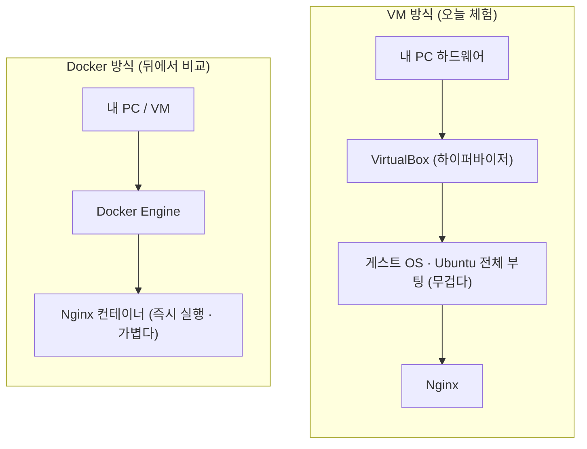
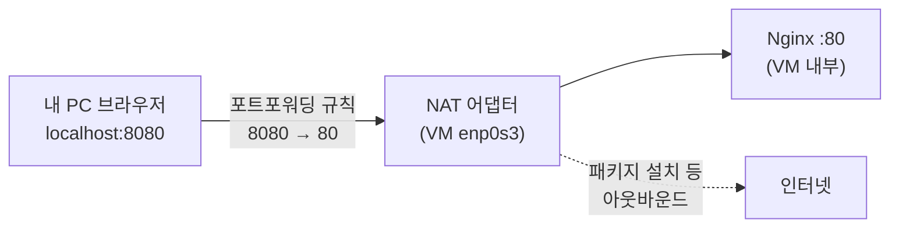
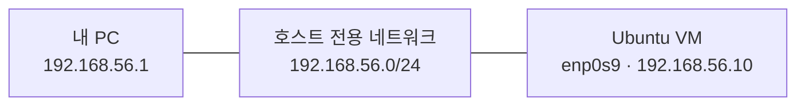
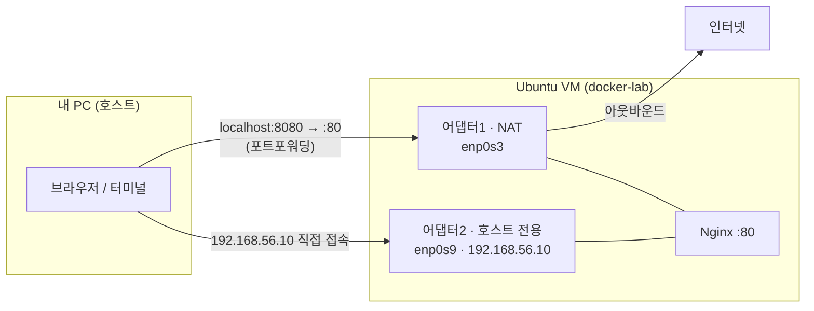

# 1-1. VM 직접 체험 — VirtualBox로 Ubuntu 서버 구축하기

!!! abstract "이 실습 한 줄 요약"
    가상머신(VM)을 직접 만들어 **"운영체제 하나를 통째로 부팅하는 비용"** 을 몸으로 느낀 뒤,
    같은 Nginx를 Docker로 실행해 **VM 방식과 컨테이너 방식을 비교**합니다.

!!! tip "먼저 사전 준비를 하셨나요?"
    VirtualBox 설치와 Ubuntu ISO 다운로드는 **[1-0. 사전 준비작업](00-pre-setup.md)** 에서 미리 하는 걸 권장합니다.
    이미 하셨다면 이 페이지의 **[3) VM 생성](#3-vm)** 부터 바로 진행하시면 됩니다. (1·2단계는 사전 준비와 동일)

!!! info "Windows / macOS 모두 안내합니다"
    설치처럼 OS마다 방법이 갈리는 부분은 아래처럼 **탭**으로 나눠 두었습니다. 본인 환경 탭을 펼쳐 진행하세요.

    === "Windows"
        Hyper-V 충돌만 정리하면 VirtualBox가 그대로 동작합니다. (아래 1단계 참고)

    === "macOS (Intel)"
        Intel 맥은 Windows와 거의 동일하게 진행됩니다.

    === "macOS (Apple Silicon · M1/M2/M3)"
        VirtualBox의 Apple Silicon 지원은 아직 **실험적**입니다. 잘 안 되면 **UTM** 대체 경로로 진행합니다.
        (1단계에서 자세히 안내)

---

## 실습 목표

이 가이드는 다음을 **직접 경험**하는 데 목적이 있습니다.

- VirtualBox(또는 Apple Silicon은 UTM)에 Ubuntu(24.04 또는 26.04 LTS) VM 설치 및 실행
- VM 부팅 속도가 느리다는 점 체감
- VM 내부에 Nginx 설치 후 **포트포워딩**으로 로컬 브라우저에서 확인
- **VirtualBox 네트워크(NAT · 포트포워딩 · 호스트 전용)** 개념 이해
- Docker 설치 후 Nginx를 한 번에 실행하여 **VM 방식과 비교**

---

## 왜 이걸 먼저 해보나 — VM의 "무게" 이해하기

VM은 **하드웨어 위에 하이퍼바이저를 얹고, 그 위에 게스트 OS를 통째로 부팅**합니다.
그래서 부팅이 느리고 자원을 많이 씁니다. 이 실습에서 그 무게를 직접 느껴 볼 겁니다.



!!! note "체감 포인트"
    같은 Nginx를 띄우는데, VM은 "OS부터 부팅"하고 Docker는 "컨테이너만 시작"합니다.
    이 차이가 뒤에서 실행 속도로 그대로 드러납니다.

---

## 준비물

- Windows / macOS / Linux PC
- 인터넷 연결
- 관리자 권한

## 공식 다운로드 링크

- [VirtualBox 공식 다운로드](https://www.virtualbox.org/wiki/Downloads)
- Ubuntu Server ISO → 아래 **2단계에서 아키텍처별(amd64 / arm64) 직접 링크**로 안내합니다
- [UTM (Apple Silicon 대체용)](https://mac.getutm.app/)
- [Docker Engine (Ubuntu) 설치 문서](https://docs.docker.com/engine/install/ubuntu/)

---

## 1) VirtualBox 설치

=== "Windows"

    !!! warning "설치 전 확인 — Hyper-V 끄기"
        Windows에서 **Hyper-V가 활성화**되어 있으면 VirtualBox가 정상 실행되지 않을 수 있습니다.
        설치 전 **PowerShell을 관리자 권한**으로 열고 아래를 실행하세요.

        ```powershell
        bcdedit /set hypervisorlaunchtype off
        ```

        실행 후 **반드시 재부팅**합니다. (VirtualBox 설치는 재부팅 후 진행)

    1. [VirtualBox 공식 다운로드 페이지](https://www.virtualbox.org/wiki/Downloads)에서 **Windows hosts** 버전을 받습니다.
    2. 기본 옵션으로 설치합니다.
    3. 설치 완료 후 VirtualBox를 실행합니다.

    !!! tip "그래도 안 되면"
        - 재부팅 후에도 실행이 안 되면 BIOS/UEFI에서 **가상화(VT-x/AMD-V)** 가 켜져 있는지 확인하세요.
        - WSL2 · Docker Desktop을 쓰고 있었다면 Hyper-V가 다시 켜질 수 있습니다. 위 `bcdedit` 명령을 다시 적용하세요.

=== "macOS (Intel)"

    1. [VirtualBox 공식 다운로드 페이지](https://www.virtualbox.org/wiki/Downloads)에서 **macOS / Intel hosts** 버전을 받습니다.
    2. `.dmg`를 열어 설치합니다.
    3. 설치 중 **"시스템 확장 차단됨"** 알림이 뜨면 `시스템 설정 → 개인정보 보호 및 보안` 에서 **허용**을 누르고, 안내에 따라 재시도합니다.

=== "macOS (Apple Silicon · M1/M2/M3)"

    !!! danger "먼저 읽어주세요 — Apple Silicon 주의"
        Apple Silicon 맥은 CPU가 **ARM**이라, x86용 VirtualBox VM이 **잘 안 되거나 매우 느릴 수** 있습니다.
        (VirtualBox 7.1+에 Apple Silicon 지원이 들어왔지만 아직 **실험적**입니다.)

    **먼저 시도:** [VirtualBox 다운로드](https://www.virtualbox.org/wiki/Downloads)에서 **macOS / Arm64** 빌드를 받아 설치해 봅니다.

    **잘 안 되면 (권장 대체 경로): UTM 사용**

    1. [UTM](https://mac.getutm.app/)을 설치합니다. (App Store 또는 공식 사이트)
    2. Ubuntu는 **ARM64용 ISO**(`...-live-server-arm64.iso`)를 받습니다. (아래 2단계 참고)
    3. UTM에서 `Virtualize → Linux`로 VM을 만들고 ISO를 지정합니다.

    !!! success "안심하세요"
        하이퍼바이저(VirtualBox / UTM)만 다를 뿐, **VM 안에서 하는 작업(Nginx·네트워크·Docker 설치)은 완전히 동일**합니다.
        네트워크 개념(NAT · 포트포워딩 · 호스트 전용)도 그대로 적용됩니다.

---

## 2) Ubuntu Server 이미지 준비 (24.04 또는 26.04 LTS)

!!! info "버전은 24.04 / 26.04 아무거나 OK — 최신 26.04 받아도 됩니다"
    이 실습은 **24.04 LTS** 와 **26.04 LTS(최신)** 에서 동일하게 동작합니다.
    기본으로 나오는 **최신 26.04 LTS(Resolute Raccoon)를 그대로 받으셔도 됩니다.**
    (Docker 저장소도 26.04를 지원해서 이후 설치 명령이 수정 없이 그대로 동작합니다.)

!!! warning "가장 중요 — 내 CPU에 맞는 아키텍처(amd64 / arm64)를 받으세요"
    ISO는 **CPU 종류에 맞는 것**을 받아야 부팅됩니다. 안 맞으면 설치가 아예 안 돼요. (특히 Mac 주의)

    - **Windows · Intel Mac → `amd64`**
    - **Apple Silicon Mac (M1·M2·M3·M4) → `arm64`**

    **내 맥 확인:** 왼쪽 위 사과 로고 → *이 Mac에 관하여* → **"Apple M..."** 이면 arm64, **"Intel..."** 이면 amd64

### 아키텍처별 다운로드 링크 (여기서 바로 받으세요)

=== "Windows · Intel Mac (amd64)"

    | 버전 | 다운로드 페이지 | 받을 파일 |
    |---|---|---|
    | **26.04 LTS** (권장·최신) | [releases.ubuntu.com/26.04](https://releases.ubuntu.com/26.04/) | `ubuntu-26.04-live-server-amd64.iso` |
    | 24.04 LTS | [releases.ubuntu.com/24.04](https://releases.ubuntu.com/24.04/) | `ubuntu-24.04.x-live-server-amd64.iso` |

=== "Apple Silicon Mac (arm64)"

    !!! danger "Apple Silicon은 VirtualBox 대신 UTM 권장"
        arm64 + VirtualBox는 아직 실험적이라 불안정할 수 있어요. **UTM**으로 진행하세요.
        (VM 안에서 하는 작업·명령은 완전히 동일합니다.)

    | 버전 | 다운로드 페이지 | 받을 파일 |
    |---|---|---|
    | **26.04 LTS** (권장·최신) | [cdimage.ubuntu.com/releases/26.04](https://cdimage.ubuntu.com/releases/26.04/release/) | `ubuntu-26.04-live-server-arm64.iso` |
    | 24.04 LTS | [cdimage.ubuntu.com/releases/24.04](https://cdimage.ubuntu.com/releases/24.04/release/) | `ubuntu-24.04.x-live-server-arm64.iso` |

---

## 3) VM 생성

### 기본 정보 입력

VirtualBox에서 **새로 만들기(New)** 를 클릭하고 아래와 같이 입력합니다.

| 항목 | 값 |
|---|---|
| 이름 | `docker-lab` |
| ISO Image | 다운로드한 Ubuntu 서버 ISO 선택 (예: `ubuntu-26.04-live-server-amd64.iso`) |
| 유형 | Linux |
| 버전 | Ubuntu (64-bit) |

### Username / Password 설정

!!! note "계정 정보"
    - **Username:** `vboxuser` (기본값 그대로 사용)
    - **Password:** 원하는 값으로 변경 가능. 단, **잊지 않도록 메모**해 두세요.

### Specify Virtual Hardware (하드웨어 설정)

**Next** 를 눌러 하드웨어 설정 단계로 이동한 뒤 아래처럼 설정합니다.

| 항목 | 값 |
|---|---|
| Base Memory | 4096 MB |
| Processors | 2 |

!!! warning
    메모리·CPU가 부족하면 설치 중 멈춤 현상이 발생할 수 있습니다.

### 디스크 설정

**Create a Virtual Hard Disk Now** 선택 후 디스크 크기를 기본값 **25GB** 그대로 사용합니다.
**Next → Finish** 로 VM 생성을 완료합니다.

---

## 4) VM 부팅 및 Ubuntu 설치

1. VM을 시작합니다.
2. Ubuntu 설치 마법사를 따라 설치합니다. (기본값 위주로 진행 — OpenSSH 설치 옵션이 보이면 체크해도 좋습니다.)
3. 설치가 완료되면 VM이 재시작되고 로그인 화면이 나타납니다. 로그인 후 다음 단계를 이어갑니다.

---

## 5) VM 부팅 속도 체감 포인트

아래를 체크해보세요.

- [ ] 전원 ON 후 로그인 화면까지 걸리는 시간
- [ ] 로그인 후 셸이 완전히 준비되는 시간
- [ ] 터미널 첫 명령 반응 속도

!!! quote "기억할 것"
    이 단계에서 **"운영체제 전체를 부팅하는 비용"** 이 있다는 점을 몸으로 느껴 두세요.
    뒤에서 Docker로 같은 Nginx를 띄우면 이 비용이 거의 사라집니다.

---

## 6) VM 내부에 Nginx 설치

VM 터미널에서 실행합니다.

```bash
sudo apt update
sudo apt install -y nginx
sudo systemctl enable nginx
sudo systemctl start nginx
sudo systemctl status nginx --no-pager
```

정상 동작 확인:

```bash
curl -I http://localhost
```

`HTTP/1.1 200 OK` 가 보이면 정상입니다.

---

## VirtualBox 네트워크 이해하기 (중요)

VM을 만들면 "네트워크를 어떻게 연결하지?"가 항상 문제입니다. VirtualBox는 여러 방식을 제공하는데,
이 실습에서는 **NAT + 포트포워딩** 과 **호스트 전용(Host-Only)** 두 가지를 함께 씁니다.
아래 개념을 먼저 잡고 가면 7·9단계가 훨씬 쉽습니다.

### 세 가지만 기억하세요

| 모드 | 인터넷(밖으로) | 호스트→VM(안으로) | 이 실습에서 |
|---|---|---|---|
| **NAT** (기본) | O (VM이 밖으로 나감) | X (직접 못 들어옴) | 어댑터1 — 인터넷·패키지 설치용 |
| **포트포워딩** | (NAT에 규칙 추가) | 지정 포트만 O | `내PC:8080 → VM:80` 연결 |
| **호스트 전용(Host-Only)** | X | O (고정 IP로 직접) | 어댑터2 — 호스트↔VM 직접 접속용 |

!!! info "왜 두 개를 같이 쓰나요?"
    - **NAT** 만 있으면 인터넷은 되는데, 내 PC에서 VM으로 **직접 들어갈 수가 없습니다.** → 그래서 특정 포트만 뚫는 **포트포워딩**을 씁니다.
    - **호스트 전용** 을 하나 더 붙이면, VM에 **고정 IP(예: 192.168.56.10)** 를 주고 포트포워딩 없이도 **자유롭게 접속**할 수 있습니다.
    - 정리: **NAT(밖으로 나가는 길) + 호스트 전용(안으로 들어오는 길)** 을 동시에 두는 구성입니다.

### NAT + 포트포워딩 (7단계에서 실습)



!!! note "호스트 포트 vs 게스트 포트"
    - **호스트 포트(8080):** 내 PC에서 접속할 포트
    - **게스트 포트(80):** VM 안에서 Nginx가 실제로 여는 포트
    - 즉 **내 PC:8080 → VM:80** 으로 연결됩니다.

### 호스트 전용 네트워크 (9단계에서 실습)



### 최종 구성 — 두 어댑터를 함께



---

## 7) 포트포워딩 설정 (Host → VM)

**목표:** 내 PC 브라우저에서 `http://localhost:8080` 접속 시 VM의 Nginx 페이지 표시

1. VirtualBox에서 **docker-lab** VM을 클릭합니다.
2. 상단 **설정 → 네트워크 → 고급 → 포트 포워딩** 을 클릭합니다.
3. 아래 규칙을 추가합니다.

| 이름 | 프로토콜 | 호스트 포트 | 게스트 포트 |
|---|---|---|---|
| nginx | TCP | 8080 | 80 |

4. 호스트(내 PC) 브라우저에서 `http://localhost:8080` 에 접속합니다.

!!! success "성공 기준"
    **Nginx Welcome 페이지**가 보이면 성공입니다. (Windows·macOS 모두 브라우저 주소는 `localhost:8080` 로 동일)

---

## 8) 다음 실습을 위한 SSH 설치

VM 터미널에서 실행합니다.

```bash
sudo apt install -y openssh-server
sudo systemctl enable ssh
sudo systemctl start ssh
```

포트포워딩에 SSH 규칙을 추가합니다.

| 이름 | 프로토콜 | 호스트 포트 | 게스트 포트 |
|---|---|---|---|
| ssh | TCP | 2222 | 22 |

이후 호스트(내 PC) 터미널에서 접속합니다.

=== "macOS / Linux"

    ```bash
    ssh -p 2222 vboxuser@localhost
    ```

=== "Windows (PowerShell)"

    ```powershell
    ssh -p 2222 vboxuser@localhost
    ```

    !!! tip
        Windows 10/11에는 OpenSSH 클라이언트가 기본 포함되어 있어 PowerShell에서 바로 `ssh` 를 쓸 수 있습니다.
        혹시 `ssh` 를 못 찾으면 `설정 → 앱 → 선택적 기능` 에서 **OpenSSH 클라이언트** 를 추가하세요.

!!! tip "SSH로 접속하면 편해집니다"
    SSH 접속 후에는 터미널에서 **복사·붙여넣기**가 자유롭습니다. 이후 실습부터는 SSH로 접속해서 진행하세요.

---

## 9) 호스트 전용 네트워크 설정 (Host-Only)

앞서 개념에서 본 **"안으로 들어오는 길"** 을 실제로 만드는 단계입니다.

### VirtualBox 어댑터 추가

!!! warning "VM을 먼저 종료하세요"
    ```bash
    sudo poweroff
    ```

1. **docker-lab** VM 설정 → **네트워크 → 어댑터 2** 탭 클릭
2. **네트워크 어댑터 사용하기** 체크
3. **다음에 연결됨:** `호스트 전용 어댑터` 선택
4. 확인 후 VM 재시작

!!! note "어댑터가 목록에 없다면"
    === "Windows / Intel Mac"
        VirtualBox 상단 **도구(Tools) → 네트워크 → Host-only Networks** 에서 어댑터를 하나 **생성(Create)** 한 뒤 다시 선택하세요.

    === "macOS (Apple Silicon · UTM 사용 시)"
        UTM은 네트워크 모드가 다릅니다. VM 설정의 **Network → Mode** 에서 **Emulated VLAN(≈NAT)** 과 **Host Only** 를 각각 추가/선택하면 됩니다.
        고정 IP·SSH 접속의 목적은 동일합니다.

### 고정 IP 설정 (Netplan)

SSH로 접속 후 관리자 권한으로 전환합니다.

```bash
sudo su
```

??? question "`sudo su` 란?"
    `sudo su` 는 일반 사용자에서 **root(관리자)** 로 전환하는 명령어입니다. 이후 명령은 관리자 권한으로 실행됩니다.

!!! warning "파일명·인터페이스 이름은 설치 방식마다 다릅니다 — 반드시 직접 확인!"
    아래 예시는 편의상 이름을 적어두었지만, **여러분 화면과 다를 수 있습니다.**
    특히 **서버 설치 ISO로 깔면** 파일명이 `00-installer-config.yaml`, 인터페이스가 `enp0s8` 처럼 나오는 게 **정상**입니다.
    그러니 아래 ①②로 **내 실제 값을 먼저 확인**하고, 그 값으로 바꿔 진행하세요.

**① netplan 파일명 확인**

```bash
ls /etc/netplan/
```

- 서버 설치본(subiquity) → 보통 `00-installer-config.yaml`
- 클라우드 이미지 → 보통 `50-cloud-init.yaml`

→ 여기서 **보인 실제 파일명**을 이후 명령에 사용하세요.

**② 인터페이스 이름 확인**

```bash
ip addr
```

- `10.0.2.x` 처럼 **DHCP로 IP를 받은** 쪽이 **NAT 어댑터**(인터넷용) — 그대로 둡니다.
- 어댑터2(호스트 전용)를 붙이고 재부팅했다면 **아직 IP가 없는 새 인터페이스**가 하나 더 보입니다.
  그 이름(예: `enp0s9`)이 바로 **고정 IP를 줄 대상**입니다.

**③ netplan 파일 편집** (①에서 확인한 실제 파일명으로)

```bash
nano /etc/netplan/00-installer-config.yaml
```

!!! danger "기존 내용을 지우지 마세요 — '추가'만 합니다"
    설치관리자가 만든 **NAT 블록(`dhcp4: true` 가 있는 것)은 인터넷 연결**입니다. 지우면 인터넷이 끊깁니다.
    **기존 블록은 그대로 두고, 호스트 전용 인터페이스 블록만 아래에 추가**하세요.

파일을 열면 이미 이런 NAT 블록이 있을 겁니다(서버 설치본 예시 — 값은 환경마다 다름):

```yaml
network:
  version: 2
  ethernets:
    enp0s8:                 # (기존) NAT — 그대로 둠
      dhcp4: true
      dhcp6: true
      match:
        macaddress: 08:00:27:xx:xx:xx
      set-name: enp0s8
```

여기에 **호스트 전용 블록만 추가**해서 아래 모양으로 만듭니다 (이름은 ②에서 확인한 실제 이름으로):

```yaml
network:
  version: 2
  ethernets:
    enp0s8:                 # (기존) NAT — 그대로 둠
      dhcp4: true
      dhcp6: true
      match:
        macaddress: 08:00:27:xx:xx:xx
      set-name: enp0s8
    enp0s9:                 # (추가) 호스트 전용 — ip addr로 확인한 실제 이름
      dhcp4: no
      addresses:
        - 192.168.56.10/24
```

!!! note "파일이 `50-cloud-init.yaml`(클라우드 이미지)라면?"
    이 경우도 방법은 같습니다. 이미 있는 NAT 블록(예: `enp0s3`)은 그대로 두고 **호스트 전용 블록만 추가**하면 됩니다.

    파일이 이렇게 되어 있다면(클라우드 이미지 예시):

    ```yaml
    network:
      version: 2
      ethernets:
        enp0s3:               # (기존) NAT — 그대로 둠
          dhcp4: true
    ```

    아래처럼 **호스트 전용 블록만 추가**합니다 (이름은 `ip addr`로 확인한 실제 이름으로):

    ```yaml
    network:
      version: 2
      ethernets:
        enp0s3:               # (기존) NAT — 그대로 둠
          dhcp4: true
        enp0s9:               # (추가) 호스트 전용
          dhcp4: no
          addresses:
            - 192.168.56.10/24
    ```

    핵심은 항상 **"기존 NAT 유지 + 호스트 전용만 추가"** 입니다.

!!! tip "nano에서 저장하고 나가는 법 (처음이라면 꼭 읽으세요)"
    nano 화면 맨 아래에 `^O Write Out`(저장), `^X Exit`(나가기) 같은 안내가 보이는데,
    여기서 **`^` 기호는 `Ctrl` 키**를 뜻합니다. (Mac에서도 `Command`가 아니라 **`Control`** 입니다.)

    순서대로 누르세요.

    1. 내용을 다 입력했으면 → **`Ctrl` + `O`** (저장 = Write Out)
    2. 화면 아래에 `File Name to Write: ...` 가 뜨면 → 파일명 그대로 **`Enter`** (이름 바꾸지 않기)
    3. **`Ctrl` + `X`** (nano 종료)

    | 하고 싶은 것 | 누르는 키 |
    |---|---|
    | 저장하기 | `Ctrl` + `O` → `Enter` |
    | 저장하고 나가기 | `Ctrl` + `O` → `Enter` → `Ctrl` + `X` |
    | 저장 안 하고 그냥 나가기 | `Ctrl` + `X` → `N` |

!!! warning "YAML은 '들여쓰기'가 생명입니다"
    - **`Tab` 키 대신 스페이스(공백)** 로 들여쓰세요. (Tab을 넣으면 오류가 납니다.)
    - 위 예시의 **칸 수(2칸씩)를 그대로** 맞추세요. 줄이 어긋나면 `netplan apply` 에서 에러가 납니다.

저장 후 적용합니다.

```bash
sudo netplan apply
ip addr show enp0s9        # enp0s9 자리에 ②에서 확인한 실제 이름
```

`192.168.56.10` 이 보이면 성공입니다.

!!! note "적용할 때 경고가 떠도 괜찮습니다"
    `Permissions for /etc/netplan/...yaml are too open` 경고가 보이면, 아래로 권한만 좁혀 주면 사라집니다. (경고일 뿐 동작에는 영향 없음)

    ```bash
    sudo chmod 600 /etc/netplan/*.yaml
    sudo netplan apply
    ```

### 접속 확인

=== "macOS / Linux"

    ```bash
    ssh vboxuser@192.168.56.10
    curl http://192.168.56.10
    ```

=== "Windows (PowerShell)"

    ```powershell
    ssh vboxuser@192.168.56.10
    curl.exe http://192.168.56.10
    ```

    !!! tip
        PowerShell에서 `curl` 은 다른 명령의 별칭일 수 있어, 실제 curl은 **`curl.exe`** 로 실행하는 것이 안전합니다.

!!! success "이후 실습에서는 `192.168.56.10` 을 VM 주소로 사용합니다."

---

## 10) Docker 설치

이제 VM 위에 Docker를 설치합니다. VM 터미널(또는 SSH 접속 후)에서 아래를 **순서대로** 실행하세요.

### 기존 패키지 제거

```bash
sudo apt remove -y docker docker-engine docker.io containerd runc
```

### 필수 패키지 및 Docker 공식 저장소 등록

```bash
sudo apt update
sudo apt install -y ca-certificates curl gnupg
sudo install -m 0755 -d /etc/apt/keyrings
curl -fsSL https://download.docker.com/linux/ubuntu/gpg \
  | sudo gpg --dearmor -o /etc/apt/keyrings/docker.gpg
sudo chmod a+r /etc/apt/keyrings/docker.gpg
echo \
  "deb [arch=$(dpkg --print-architecture) signed-by=/etc/apt/keyrings/docker.gpg] \
  https://download.docker.com/linux/ubuntu \
  $(. /etc/os-release && echo "$VERSION_CODENAME") stable" \
  | sudo tee /etc/apt/sources.list.d/docker.list > /dev/null
```

!!! note "Apple Silicon(arm64)에서도 그대로 동작합니다"
    위 저장소 등록은 `arch=$(dpkg --print-architecture)` 로 **아키텍처를 자동 인식**합니다.
    ARM64 Ubuntu(UTM)에서도 수정 없이 그대로 실행하면 됩니다.

### Docker Engine 설치

```bash
sudo apt update
sudo apt install -y docker-ce docker-ce-cli containerd.io docker-buildx-plugin docker-compose-plugin
```

### Docker 서비스 시작 및 자동 실행 등록

```bash
sudo systemctl enable docker
sudo systemctl start docker
sudo systemctl status docker --no-pager
```

### sudo 없이 docker 명령어 사용 (선택)

```bash
sudo usermod -aG docker $USER
newgrp docker
```

### 설치 확인

```bash
docker version
docker run hello-world
```

!!! success "완료"
    **`Hello from Docker!`** 메시지가 출력되면 Docker 설치가 완료된 것입니다.

---

## 정리 — VM vs Docker, 무엇을 느꼈나

- VM은 **OS를 통째로 부팅**해야 해서 느리고 무겁다 (5단계에서 체감).
- 네트워크도 **NAT·포트포워딩·호스트 전용**을 직접 구성해야 연결된다.
- 반면 Docker는 **엔진 위에 컨테이너만** 올리면 되어 훨씬 가볍고 빠르다.

!!! tip "다음 실습 예고"
    다음 시간에는 이 VM 위 Docker로 **이미지 pull → run → 확인**을 반복하며,
    방금 VM으로 힘들게 한 Nginx 실행이 컨테이너로는 얼마나 간단한지 비교해 봅니다.
