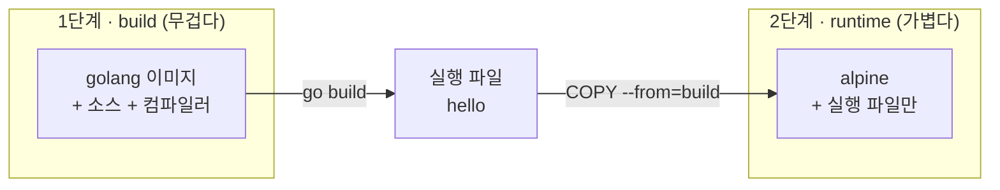

# 1-7. 멀티스테이지 빌드로 이미지 다이어트

!!! abstract "빌드용과 실행용을 나눠 이미지를 확 줄입니다"
    프로그램을 '빌드하는 데 필요한 도구'는 무겁습니다. 그런데 **실행할 땐 결과물(실행 파일)만** 있으면 되죠.
    멀티스테이지 빌드는 이 둘을 나눠서, 최종 이미지를 **수십 배** 작게 만듭니다.

## 실습 목표

- 멀티스테이지 빌드가 무엇이고 왜 쓰는지 이해한다
- 단일 스테이지 vs 멀티스테이지 **이미지 크기를 직접 비교**한다

---

## 1) 개념 — 빌드 단계 / 실행 단계 나누기



핵심은 **1단계에서 만든 결과물만 2단계로 복사**하고, 무거운 빌드 도구는 버리는 것입니다.

---

## 2) 준비 — 아주 작은 Go 프로그램

```bash
mkdir ~/multi && cd ~/multi
cat > hello.go <<'EOF'
package main
import "fmt"
func main() { fmt.Println("hello multistage") }
EOF
```

!!! note
    Go 문법을 몰라도 됩니다. **"한 줄 출력하는 프로그램"** 이에요. (멀티스테이지 효과를 보기 좋은 예시라 Go를 씁니다.)

---

## 3) 실습 ① — 단일 스테이지 (크다)

`Dockerfile` 을 아래 내용으로 작성합니다.

```dockerfile
FROM golang:1.23
WORKDIR /app
COPY hello.go .
RUN CGO_ENABLED=0 go build -o hello hello.go
CMD ["./hello"]
```

빌드하고 크기를 봅니다.

```bash
docker build -t hello:single .
docker run --rm hello:single       # → hello multistage
docker images hello:single         # SIZE 확인 (수백 MB)
```

→ golang 이미지·컴파일러·소스가 **최종 이미지에 통째로 남아** 큽니다.

---

## 4) 실습 ② — 멀티스테이지 (작다)

`Dockerfile` 을 아래로 바꿉니다.

```dockerfile
# 1단계: 빌드 (무거운 golang 이미지에서 컴파일)
FROM golang:1.23 AS build
WORKDIR /app
COPY hello.go .
RUN CGO_ENABLED=0 go build -o hello hello.go

# 2단계: 실행 (가벼운 alpine에 '결과물만' 복사)
FROM alpine:latest
WORKDIR /app
COPY --from=build /app/hello .
CMD ["./hello"]
```

```bash
docker build -t hello:multi .
docker run --rm hello:multi        # → hello multistage (똑같이 동작!)
docker images hello:multi          # SIZE 확인 (수십 MB)
```

!!! info "핵심 — `COPY --from`"
    `COPY --from=build /app/hello .` 이 한 줄이 마법입니다.
    1단계(`build`)에서 만든 **결과물만** 2단계로 가져오고, 무거운 빌드 도구는 버립니다.

---

## 5) 크기 비교

```bash
docker images | grep hello
```

| 이미지 | 방식 | 크기(대략) |
|---|---|---|
| `hello:single` | 단일 스테이지 | **수백 MB** (golang 통째로 포함) |
| `hello:multi` | 멀티스테이지 | **10MB대** (alpine + 실행 파일만) |

→ **동작은 똑같은데** 크기가 확 줄었죠? (정확한 값은 `docker images` 의 SIZE 열로 확인하세요.)

---

## 6) (도전) 더 줄이기 — `scratch`

아무것도 없는 빈 베이스 `scratch` 를 쓰면 더 작아집니다. (순수 실행 파일만)

```dockerfile
FROM golang:1.23 AS build
WORKDIR /app
COPY hello.go .
RUN CGO_ENABLED=0 go build -o hello hello.go

FROM scratch
COPY --from=build /app/hello /hello
CMD ["/hello"]
```

```bash
docker build -t hello:scratch .
docker run --rm hello:scratch
docker images | grep hello
```

→ 몇 MB 수준까지 작아집니다. 단, `scratch` 는 **셸이 없어** `docker exec` 로 못 들어갑니다.

---

## 정리

- 멀티스테이지 = **빌드 단계 / 실행 단계 분리** → 최종 이미지엔 결과물만.
- `FROM ... AS build` 로 단계에 이름을 붙이고, `COPY --from=build` 로 결과물만 복사.
- 이미지가 작을수록 **push/pull 이 빠르고, 공격 표면도 작아** 보안에도 유리합니다.
