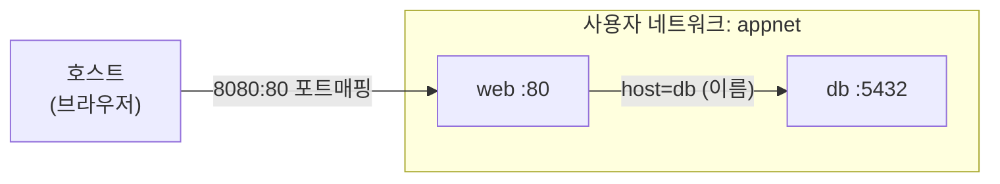

# 1-9. Docker 네트워크 — 컨테이너끼리 연결하기

!!! abstract "밖에서 들어오기 & 안에서 서로 통하기"
    컨테이너 네트워크는 크게 두 가지입니다.
    **① 외부 → 컨테이너**(포트 매핑)와 **② 컨테이너 ↔ 컨테이너**(이름으로 통신).
    이번 실습에서 둘 다 직접 만들어봅니다.

## 실습 목표

- 포트 매핑으로 **외부에서** 컨테이너에 접속한다
- 사용자 정의 네트워크에서 컨테이너를 **'이름'으로** 통신시킨다
- 기본 bridge 와 사용자 정의 네트워크의 차이를 이해한다

---

## 1) 외부 → 컨테이너 : 포트 매핑 (복습)

```bash
docker run -d --name web -p 8080:80 nginx
curl -I http://192.168.56.10:8080     # 내 PC(호스트)에서 접속
```

`-p 8080:80` = 호스트 8080 → 컨테이너 80. 외부에서 들어오는 길은 **포트 매핑**입니다.

---

## 2) 컨테이너끼리는? — 기본 bridge의 한계

기본 네트워크에 있는 컨테이너는 **이름으로 서로를 못 찾습니다.** 직접 확인해봅시다.

```bash
docker run -d --name def1 nginx
docker run --rm alpine ping -c 1 def1     # → bad address 'def1'  (이름 통신 X)
docker rm -f def1
```

!!! warning "왜 안 되나요?"
    Docker의 **기본 bridge** 네트워크는 이름 → IP 변환(DNS)을 안 해줍니다.
    그래서 컨테이너끼리 이름으로 통신하려면 **사용자 정의 네트워크**가 필요해요.

---

## 3) 사용자 정의 네트워크 — 이름으로 통신

```bash
docker network create appnet
docker run -d --name c1 --network appnet nginx
docker run --rm --network appnet alpine ping -c 3 c1     # → 이름 c1 으로 통신됨!
```

!!! success "확인"
    같은 사용자 네트워크(`appnet`)에 붙으면, **IP를 몰라도 컨테이너 이름(`c1`)** 으로 통신됩니다.
    (사용자 정의 네트워크는 내부 DNS를 제공하기 때문)

---

## 4) 실전 — App 이 DB 에 '이름'으로 접속

```bash
docker run -d --name db --network appnet -e POSTGRES_PASSWORD=pass postgres:16
docker run --rm --network appnet -e PGPASSWORD=pass postgres:16 \
  psql -h db -U postgres -c "SELECT 'connected!' AS result;"
```

→ `-h db` 처럼 **IP가 아닌 이름 `db`** 로 접속됩니다. 실제 웹앱이 DB에 붙는 방식이 이거예요.



---

## 5) 네트워크 들여다보기

```bash
docker network ls                 # 네트워크 목록
docker network inspect appnet     # appnet에 붙은 컨테이너 확인
```

---

## 정리

**실습 정리(삭제):**

```bash
docker rm -f web c1 db 2>/dev/null || true
docker network rm appnet 2>/dev/null || true
```

- **외부 → 컨테이너** : 포트 매핑(`-p`).
- **컨테이너 ↔ 컨테이너** : 같은 **사용자 정의 네트워크** + **이름**(DNS).
- 기본 bridge는 이름 통신이 안 되니, 여러 컨테이너를 엮을 땐 **네트워크를 직접 만들어** 붙이자.
